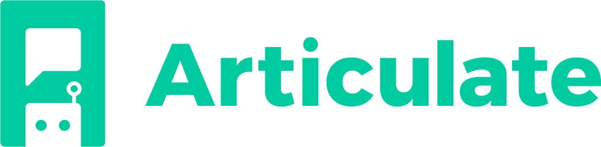
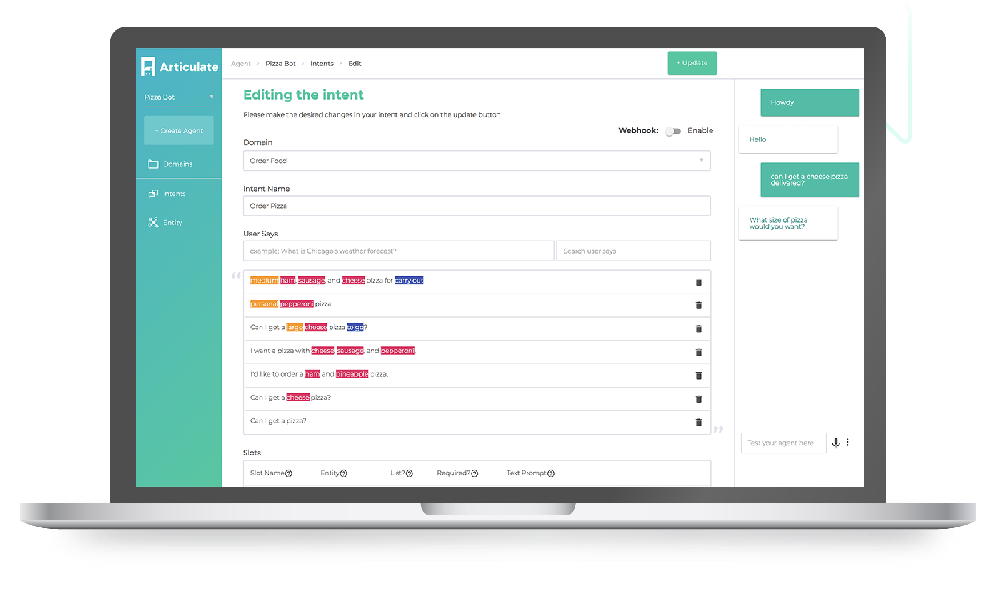

## A platform for building conversational interfaces with intelligent agents

[](https://gitter.im/samtecspg/articulate?utm_source=badge&utm_medium=badge&utm_campaign=pr-badge&utm_content=badge)



## Documentation

https://samtecspg.github.io/articulate/

## QUICK START

Make sure you've got these programs installed:

   * [Docker](https://docs.docker.com/engine/installation/) (If faced with any choices, get the Community Edition ("CE"))
   * [`docker-compose`](https://docs.docker.com/compose/install/) (should be auto-installed as part of Docker on mac and windows)
   
> Running on Docker Machine or in the cloud, make sure to check out our [alternate installation](https://samtecspg.github.io/articulate/getting_started/basic-installation#running-remotely) docs.

> Docker for Windows and Docker for mac users, make sure you are [allocating at least 4Gb of RAM to Docker](https://docs.docker.com/docker-for-mac/#advanced).

1. Download the current release zip (articulate-vX.X.X.zip): https://github.com/samtecspg/articulate/releases/latest

2. Unzip and get a terminal or CMD in the release directory

3. run `docker-compose up` (`sudo` might be needed)

4. point your web browser at  http://localhost:3000 and enjoy Articulate

## License
```
Copyright 2018 Samtec.

Licensed under the Apache License, Version 2.0 (the "License");
you may not use this file except in compliance with the License.
You may obtain a copy of the License at

    http://www.apache.org/licenses/LICENSE-2.0

Unless required by applicable law or agreed to in writing, software
distributed under the License is distributed on an "AS IS" BASIS,
WITHOUT WARRANTIES OR CONDITIONS OF ANY KIND, either express or implied.
See the License for the specific language governing permissions and
limitations under the License.
```
